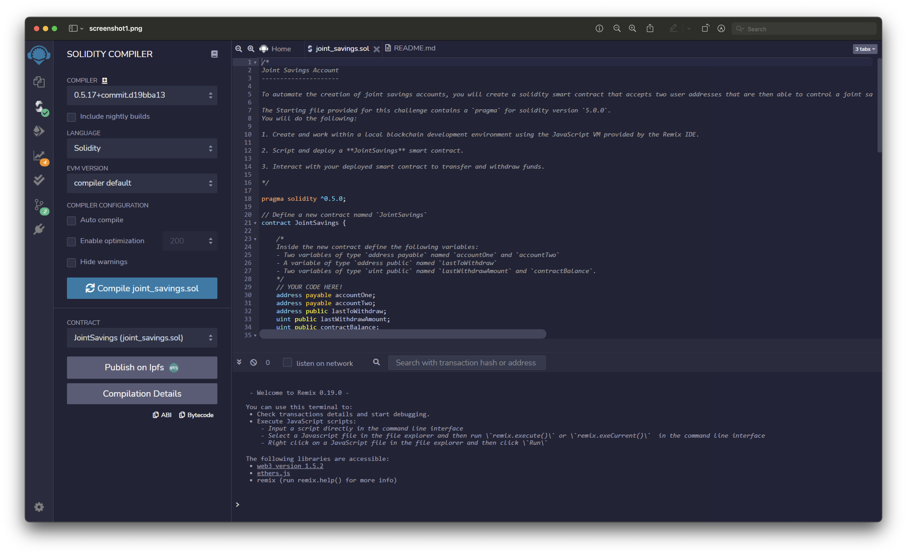
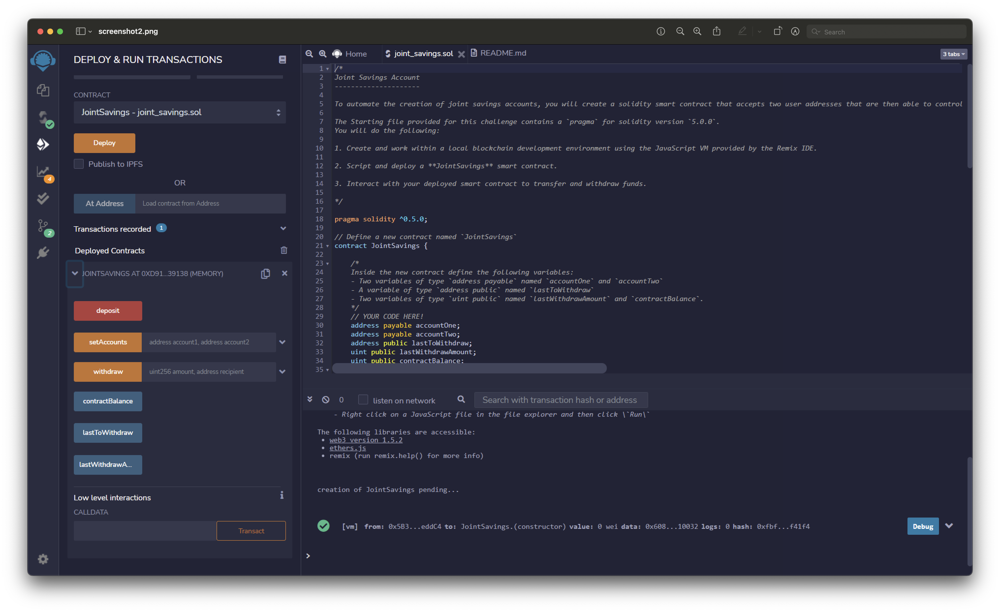
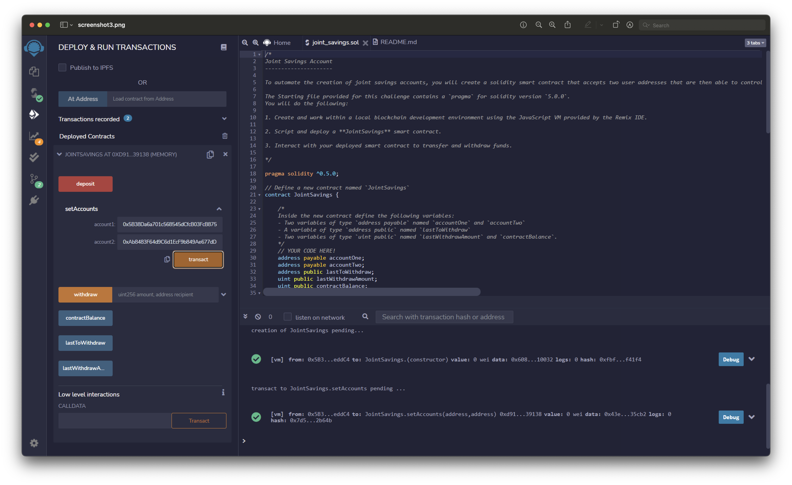
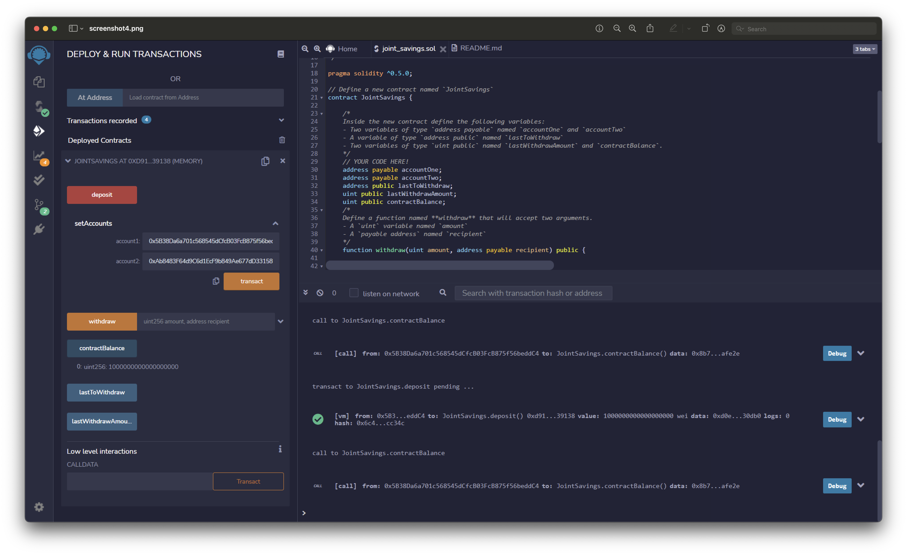
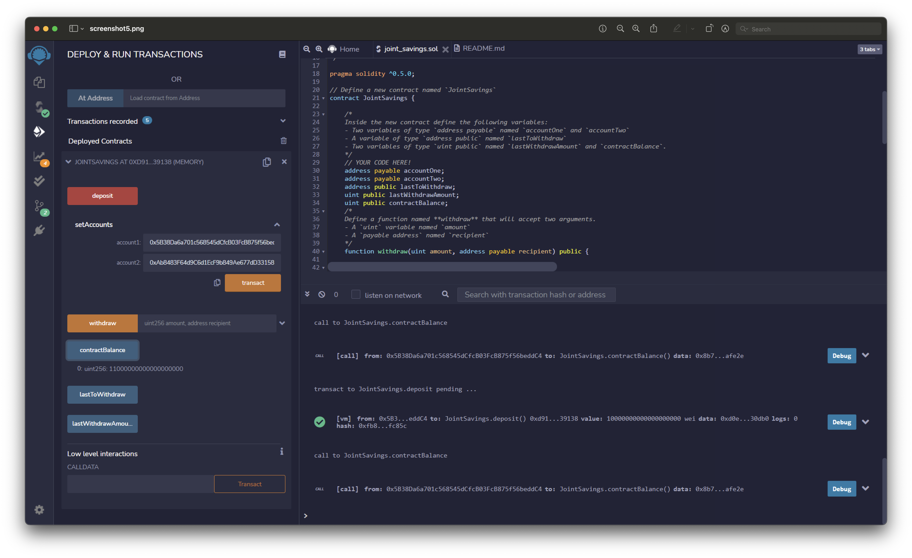
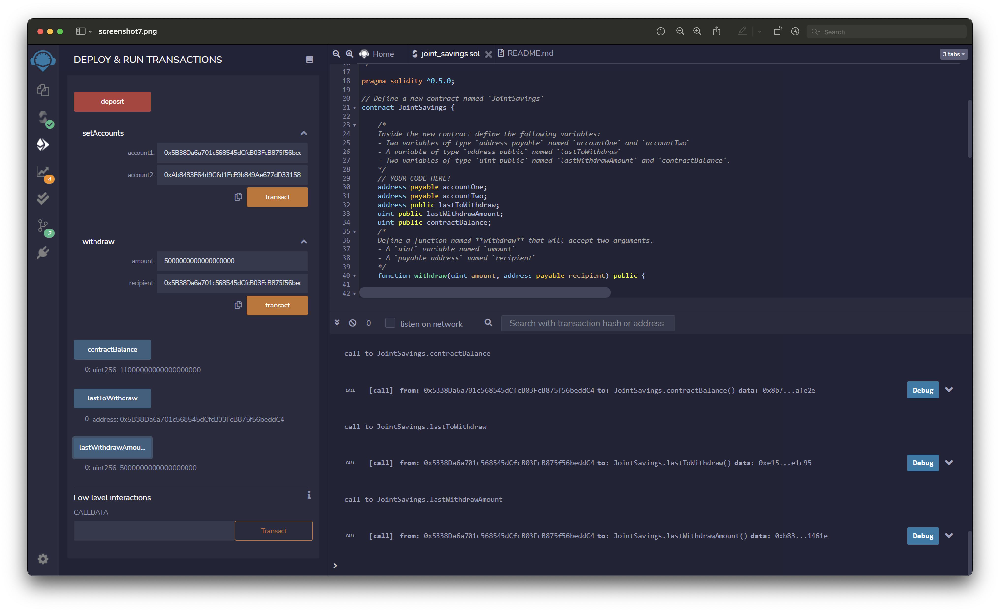

# joint_savings

Joint savings account with Solidity
1. Compile the smart contract

2. Deploy the smart contract

3. Set the withdrawal accounts

4. Send 1 ether as wei to the smart contract

5. send 10 ether as wei to the smart contract

6. Send 5 ether to the smart contract

7. Withdraw 5 ether into AccountOne

8. Withdraw 10 ether into AccountTwo

